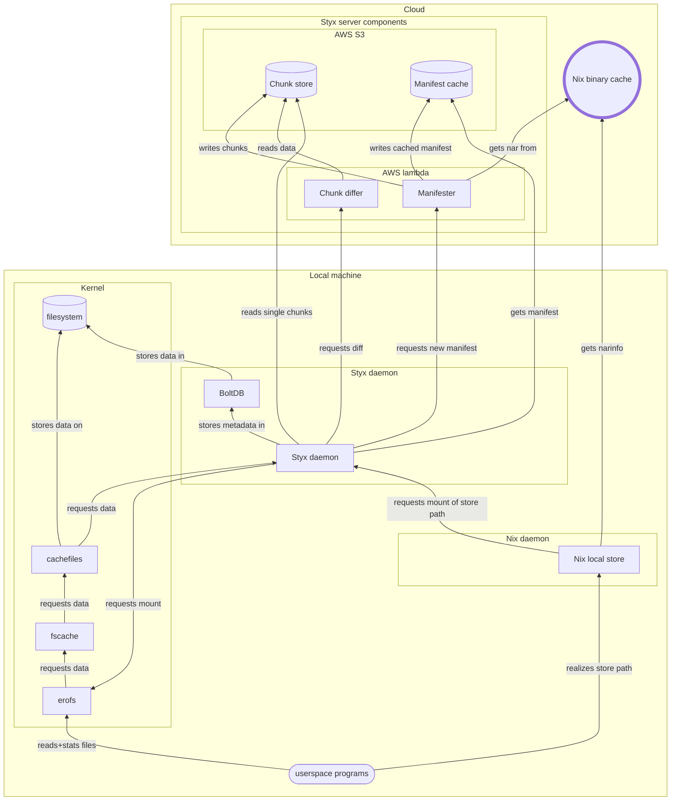

# Styx

## Introduction

Styx is an alternate binary substitution mechanism for Nix.
It downloads data on-demand,
stores common chunks of data only once to reduce local disk usage,
and uses differential compression to reduce bandwidth usage.

It's currently quite experimental, though the basic features are working.
If you want to try it, skip down to the bottom.

### Motivation

Before explaining exactly what it does and how it works, let me motivate things
a little:

We all know that Nix uses a ton of storage and bandwidth. This is because of how
it works: each package contains absolute references to its dependencies, so if
package with dependents changes all the packages that depend on it have to
change also. If a package near the root of the dependency tree (e.g. glibc or
systemd) changes, pretty much everything changes.

When a package changes, you have to download a nar file containing that package.
The nar file is compressed with xz, which is as good as it gets for general
purpose compression, but it can only eliminate redundancy within the package,
not across packages or versions of a package.

When a package's dependency changes without any other change, the new version is
usually very similar to the old one. Small version bumps produce slightly bigger
changes but often still quite small. Nix's binary fetching and storage mechanism
can't take advantage of any of that, though, it always downloads a full
xz-compressed nar. If we could take advantage of the similarities of data across
versions of a package, we could save both bandwidth and storage space.

My first try at seeing if I could improve this situation was
[nix-sandwich][nxdch], which does differential compression for nar downloads.
This works surprisingly well! But it has a bunch of limitations: it struggles
with large packages, and it does nothing to improve the situation with local
disk storage. I wanted to use some of those ideas but also try to address the
storage problem at the same time.

### Storage

Nix's optimize-store works by hard-linking files. This provides some benefit,
but only if the whole file is identical. Files that are very similar, even the
same except for a few changed hashes, get no benefit at all.

To do better we have to take advantage of common data within files. Some modern
filesystems like btrfs provide a way to share extents (block-aligned ranges of
files). If we combined that with differential-compressed downloads, that would
address both parts of the problem.

### On-demand

But I was also thinking about another obvious way to reduce bandwidth and
storage: not downloading or storing files that aren't used. For various reasons,
it's common for packages to end up in NixOS system closure that aren't actually
used. It seems silly to download new versions of them at every system update.

I also have a bunch of packages in my configuration that I use rarely. For
example, I might fire up [darktable][dt] only a few times a year, but I end up
downloading it with every update. Sure, I could leave it out of my configuration
and just use `nix-shell -p`, but that's extra hassle I shouldn't have to do.

What if most packages on my system were "installed", but the data wasn't even
fetched until they were used? Of course, after it was fetched then it should be
cached locally for fast access.

### What about FUSE?

If you're familiar with the Linux filesystem space, you might be thinking FUSE:
run a daemon that serves a Nix store in a smart way, doing fancy [de]compression
and fetching data on-demand.

Well, Styx is similar to that, but better:

The problem with FUSE is the performance overhead. Since each stat and read (no
writes, packages in the store are immutable) has to go to the kernel, then to
userspace, then back to the kernel, there's unavoidable latency.

What we really want for this on-demand thing is a way for the kernel to ask us
for files or parts of files, and then store that data and serve it from kernel
space in the future.

### EROFS

It turns out there's some new experimental stuff in Linux that works exactly
like this: [EROFS][erofs] + [on-demand fscache][erofs_over_fscache] was created
for the [container ecosystem][nydus], but there's a lot of similarities with
what we want for Nix.

EROFS is a read-only filesystem format and driver, similar to SquashFS and
others, but much more flexible in where the "data" actually comes from. It can
do things like mount tar files without moving or copying the data. Most
importantly for us, it can mount filesystems where the data, and even the
metadata, isn't present on the system in any form yet. Instead, the data can be
requested from a userspace daemon on-demand using the fscache mechanism.

Additionally, it can share data between different "filesystems" and present them
while only storing one backing copy.

Styx hooks up this EROFS + fscache stuff to a Nix binary cache and local store,
plus an external service for on-demand differential compression, to get all the
properties we're looking for.

There's still some overhead compared to a plain filesystem, since we essentially
have a filesystem on a filesystem. However, once cached, stats and reads are
served with one trip into the kernel. (Benchmarks TBD)


## Overall design

Let's get the big complex diagram out there for reference:



Then a few definitions:

**Block**: EROFS filesystems have a block size, like all filesystems. Styx uses
4KiB blocks. (I think currently the block size must match the system page size.)

**Chunk**: To reduce metadata overhead, the unit of data sharing and data
movement is larger than a single block. The chunk size is adaptive on a per-file
basis depending on the file size, and is currently either 64 KiB, 256 KiB, or 1 MiB.

**Chunk digest**: Chunks are identified by a cryptographic digest. Currently we
use a 192-bit prefix of SHA-256.

**Manifest**: The goal is that we don't want to download a full nar file (which
has metadata and file data), but we do need all the metadata to create an erofs
image. So we need a thing that has just the metadata from the nar file. But, it
also needs *digests* of the data, or actually the chunks of the data, so that we
can figure out the sharing structure. We call this a "manifest". It's similar to
a nar listing (supported by some binary caches), but with two addtions: For tiny
files and symlinks, we do include the data inline. For larger files, we break
them into chunks and include the digest of each chunk.

**EROFS image**: Styx constructs one EROFS image per store path. The image has
only metadata and small inline file data. The actual data is pointers to slab
devices.

**Slab**: A slab is a virtual device that contains all the chunks that we know
about, concatenated together (padded to the block size). A slab can hold one TB
and we can have many slabs. Even though it looks big, don't worry, disk space is
allocated only on-demand.

**Slab image**: Due to the design of cachefiles, we can only write data through
its interface, we can't read it back out. We need to read chunks that we've
written to construct the base for binary diffing. To do this, we mount a special
image that exposes the entire slab device as a single large file. This also
looks big but doesn't take any actual disk space.

**Manifest slab**: Large manifests themselves are broken into chunks. These
chunks aren't stored in a slab, though, they're stored in a manifest slab. This
one is just a plain old file, no EROFS or cachefiles stuff going on.

**Styx daemon**: This runs in your local machine, next to the Nix daemon.

**Chunk store**: An object store with one object per chunk.

**Manifest cache**: An object store with one object per constructed manifest.

**Manifester**: Server that can convert nar files into manifests, storing chunks
of data in a chunk store.

**Chunk differ**: Server that can compute binary diffs between arbitrary
sequences of chunks on demand.


Now we can describe the pieces and flow:

For requesting a new store path, it goes something like this:

1. A user asks the Nix daemon to realize a store path.
1. The Nix daemon queries a binary cache to see if it can substitute (requests narinfo).
1. If if finds it, and if configured, it asks Styx to substitute it instead of
   downloading the nar file.
1. Styx checks if it has an EROFS image already built. If not:
1. It checks the manifest cache to see if it can just download one. If not:
1. It asks the manifester to create a manifest for the nar.
    1. The manifester gets the narinfo and nar file.
    1. It breaks the data into chunks and stores them in the chunk store.
    1. It stores the completed manifest in the manifest cache for future requests.
    1. It returns the manifest to the Styx daemon.
1. Now the Styx daemon has a manifest. It creates an EROFS image from the
   manifest and holds it in memory.
1. It asks the kernel to mount an EROFS on the destination store path.
1. The kernel calls into EROFS, which calls into fscache, which calls into
   cachefiles, which makes a request to the userspace cachefiles daemon.
1. Styx acts as the userspace cachefiles daemon and gets the request for the
   contents of the EROFS image. It supplies the image that it kept in memory.
1. Cachefiles writes the image to disk in its internal cache and supplies the
   data to EROFS.
1. The kernel complets the mount operation. The store path is now mounted in the
   filesystem and can be stat'ed and readdir'ed with no additional interaction
   from Styx or Nix.
1. Styx reports success to Nix.
1. Nix records that the store path has been successfully substituted.

That's the simple case. There are a few complications that might happen:

1. The manifest might be "chunked" itself. We do this when it's too big and
   could benefit from differential compression. In this case, we have to get the
   chunks of the manifest to reassemble it before we can build the image. This
   basically follows the read path below, so read that first.
2. If this is the first image we're mounting, EROFS will also request to open
   the slab device(s). The Styx daemon responds to that by setting up some
   internal data structures. But then it also mounts the slab image (this is so
   we can read from it). This is another round-trip through the kernel and back
   up to Styx, where it returns a single 4KiB image. It then keeps an open
   file descriptor to the slab file within the slab image.


Now suppose a userspace program does a read from a file. That looks like this:

1. Userspace calls read on a file in a Styx EROFS mount.
1. The EROFS filesystem that we constructed tells EROFS that the chunk at that
   offset is actually found at a particular offset in a different "device",
   which is actually our slab file.
1. If the data at that offset of the slab file is cached, it can return that.
   Note that the data may have been cached by another image, the slab file is
   shared.
1. If not, it requests the data from Styx.
1. Styx figures out what chunk is at that offset.
1. Now there are a few options for how it can get the data for that chunk:
    1. It can request the single chunk from the chunk store.
    1. It can guess that some nearby chunks are also going to be requested, and
       ask the chunk differ to recompress and send a batch of chunks at once. This
       is higher latency (the server side is doing more work), but will generally
       give better compression than individual chunks.
    1. It can guess that the requested chunk and some nearby chunks are likely to
       be similar to a run of chunks that it already has. E.g., a bunch of chunks
       for a newer version of a package are similar to the corresponding chunks
       from the previous version of the same package. It can ask the chunk differ
       for a binary diff, which can provide much better compression.
1. Once it has the data, it supplies it to cachefiles, and the read completes.


## Discussion and notes

### Security

Nix's security for binary substitution is based on the nar hash: a cryptographic
digest of the whole nar file. Since our goal is to avoid downloading nar files,
we can't verify a nar hash at substitution time. (We can verify it if all data
for a package is completely fetched, but that might never happen for some
packages.)

Instead, the manifester verifies the nar hash, and then signs the manifest with
its own key. The Styx daemon verifies the manifest signature. This obviously
means that **the end user needs to trust the manifester**, in addition to the
nar signer as usual. This is sort of unfortunate but it's the best we can do
without changing Nix itself. With tighter intergration to Nix and a different
binary cache substitution protocol, we could of course do better here.

Note that we don't have to trust the chunk store, manifest cache, or chunk
differ: chunks are content-addressed so can be verified independently.


### Chunking schemes

EROFS basically imposes a chunking scheme on us: aligned chunks of some fixed
power-of-two multiple of the block size, sequentially from the start of each
file.

(Note that EROFS supports more flexible chunking when using its compression
features. As far as I can tell, you can't use both compression and cross-image
sharing at once. Maybe that'll be possible in the future.)

How does this compare to content-defined chunking (CDC)? CDC can theoretically
share more data, especially if you use a smaller chunk size. But chunks at
non-aligned offsets add more overhead to reconstructing files. Of course you can
transfer data with CDC and reconstruct it into a filesystem. But then you lose
the benefits of CDC in the local filesystem.

The idea of Styx is to partially decouple local storage sharing from network
transfer sharing. Local storage uses aligned fixed size chunks for performance
(this part isn't really changeable), but as long as we can reconstruct the data,
we can inject anything into Styx: whole nar files, CDC-reconstituted nars,
differentially-compressed nars, or (the current implementation)
differentially-compressed/individually-retrieved chunks.

There are some nice properties of using the same chunks for transfer that we do
for storage, notably it reduces the metadata overhead of keeping track of what
we have and what we're missing, and makes building manifests simpler. But it's
not strictly required.

One additional benefit of aligned fixed-size chunking is that we can support
materializing data on regular filesystems using the same chunks, without using
any extra disk space: if you wanted to have a local CDC content-addressed chunk
store, but also a usable Nix store, you'd have to duplicate all your data. With
aligned fixed-sized chunks plus a filesystem that supports extent sharing, like
btrfs or XFS, the materialized store can share the same underlying blocks as the
slab file, using no extra space. See "Materialize" and "Vaporize" below.


### Diffing compressed files

If you've poked around in your Nix store, you might have noticed some packages
contain compressed files. Prominent examples are man pages (compressed with
gzip), Linux kernel module files (compressed with xz), and Linux firmware
(compressed with xz). This makes some sense for normal substitution, since those
files aren't often used and can be smaller on disk.

For Styx, though, this is actually counterproductive: Files that are not used are
simply never downloaded, so it doesn't matter whether they're compressed or not.
Per-file compression also interferes with Styx's differential compression (and
nar compression too for that matter): A small change in a file will produce a
large change in the compressed version of that file, at least after the first
point where they differ.

Can we still get some benefits of differential compression? Yes, we just have to
do it on the uncompressed data: To construct a diff, we decompress a whole
target file and a whole base file, and diff those. The tricky part is that when
we reconstruct the target, we get it in uncompressed form, but we need the
compressed form. So we have to recompress it. In general, this may not be
possible: compression algorithms may not be deterministic, and even if they are,
they may have many parameters that affect the output and we may not know the
exact parameters used the first time.

It turns out that in the most common cases, it is possible:

- Man pages are compressed with gzip with default settings (level 6), and gzip
  is very stable.
- Linux kernel modules are compressed with xz with non-standard but known
  settings, which are deterministic and seem stable from version to version.


### Prefetch

Sometimes you know that you're going to need to download almost all the data in
a package and want to just ensure it's there, instead of fetching it on-demand.
Essentially, you just want the differential compression features of Styx without
the on-demand. After a package has been installed by Styx as an EROFS mount, do:

```sh
styx prefetch /nix/store/...-mypackage/
```

This is slightly more efficient than just reading all the files (it uses
different parameters for fetching).

### Materialize

Sometimes you might want only differential compression and not on-demand
fetching, but furthermore you need the files to be present on a "real"
filesystem, e.g. because you're using Styx to download your kernel or firmware
or something that has to be present in early boot.

For that case there's `materialize`: This is similar to mounting a package as
EROFS and then copying into a plain filesystem, but more efficient:

1. If you're using a filesystem with extent sharing like btrfs and materializing
   on the root fs, the destination will share extents with the Styx slab file,
meaning it will use no extra space.
2. If you're using a filesystem without extent sharing, the copy will still be
   done with `copy_file_range`, which is a little more efficient.

Downloading the data is done with the same parameters as prefetch.

You can tell Nix to use Styx to materialize packages using the
`styx-materialize` setting.

### Vaporize

The opposite of "materialize" is "vaporize": this copies data from a local
filesystem into the Styx slab file (on btrfs it will attempt to share extents
where possible).

Why would you want to do this? When transitioning a system to use Styx for more
packages, it would be nice to be able to share space with existing packages
where possible. This lets you do that: you can vaporize all or most of your Nix
store (without consuming much extra disk space), then install (either mount or
materialize) new packages with Styx avoid downloading some data that you already
have.

Note that you can't diff from these chunks, initially, because they may not
exist on the remote chunk store. After mounting/materializing at least one
package that refers to the same chunks, they'll be available for diffing through
that package.

In some sense, vaporize + materialize is a fancy de-duplication mechanism for
btrfs and similar filesystems, that also integrates with Styx' on-demand and
compression features.

```sh
nix-store -qR /run/current-system |
  xargs stat -f -c '%n %T' | grep -v erofs | cut -d ' ' -f 1 |
  xargs -n 1 styx vaporize
```

Note that vaporize is not optimized and is pretty slow right now, but you only
have to do it once.


### GC

So far we've only written data. How do we clean things up? There's enough
metadata in the db to trace all chunk references, so we can find unused chunks.
We can then use `fallocate` with `FALLOC_FL_PUNCH_HOLE` to free space in the
slab file.

```sh
# basic stats:
styx gc | jq
# more stats on data freed:
styx gc --with_freed_stats | jq
# nothing actually happens until you use --doit
styx gc --doit
# you may need to include this to handle images that weren't fully mounted:
styx gc --error_states --doit
```

*This is only lightly tested.*


### CI

There's a CI system (named Charon, on theme) that builds a basic NixOS
configuration with the custom kernel options and patched Nix, and pushes it to a
binary cache on S3.
It re-builds on any update to either the NixOS channel or to the Styx release
branch.
This makes it possible to try Styx without building your own patched kernel.

It also builds Styx manifests and pushes all the required chunks into the chunk
store, so that requests can be satisfied quickly from the manifest cache.


### Cost of server components

TBD


## How to use it

Note that Styx requires two "experimental" kernel options to be enabled, so all
of the following commands will build a custom kernel. You can use the Styx
binary cache to avoid building it yourself.

At least kernel 6.8 is required since some bugs were fixed. For now
(nixos-24.05), you can use `boot.kernelPackages = pkgs.linuxPackages_latest;` to
get a 6.9+ kernel.

This will also replace the system Nix with a patched Nix, also available on the
binary cache.

#### Run the test suite in a VM

```sh
testvm
testvm -t btrfs  # run with btrfs root fs
```

#### Run the test suite on this machine (requires custom kernel build)

```sh
testlocal
```

#### Start a VM with Styx running and available

*This will use services in my AWS account. I may turn it off or break it at any time.*

```sh
runvm
# log in with test/test
# then run "sudo StyxInitTest1" to set up parameters
```

The VM will be set up with `<nixpkgs>` shared on `/tmp/nixpkgs` and set on
`NIX_PATH`. Styx will be configured to substitute all packages ≥ 32KiB. So start
with `nix-shell -p ...` and see what happens.

#### Use it in your system configuration

*Don't do this on a production system, this stuff is still pretty experimental*

```nix
   imports = [
     "${fetchTarball "https://github.com/dnr/styx/archive/release.tar.gz"}/module"
     # or use your preferred pinning method
   ];
   # This enables all features and patches.
   # Look at module/defualt.nix for more fine-grained enable options if desired.
   services.styx.enable = true;
   # This sets a list of package name regexes to use Styx on-demand.
   # This shouldn't include anything you need to boot a system and connect to
   # the network.
   nix.settings.styx-include = [ "list" "of" "package" "name" "regexp-.*" ];
   # This sets a list of package name regexes to use Styx materialize.
   # It's safe to include everything here, if Styx fails, Nix will fall back
   # to normal substitution.
   nix.settings.styx-materialize = [ ".*" ];
```

After the daemon is running, you have to initialize it by running:

```sh
StyxInitTest1

# or manually, run a command line:
styx init --params=https://styx-1.s3.amazonaws.com/params/test-1 --styx_pubkey=styx-test-1:bmMrKgN5yF3dGgOI67TZSfLts5IQHwdrOCZ7XHcaN+w=
```


## Roadmap and future work

### Realistic

- Improve chunk diff selection algorithm. The current algorithm is a very crude
  heuristic. There's a lot of potential work here.
    - Improving base selection
        - Getting a 'system" for each package and only using same system as base
        - Using multiple bases
    - Exploring other approaches like simhash
    - Consider how to make diffs more cacheable
- Combine multiple store paths into images to reduce overhead
- Run a system with everything not needed by stage1+stage2 on Styx
- Closer integration into other binary caches and maybe Nix itself


### Slightly crazy

- Boot a system with almost everything in the store in Styx (kernel + initrd
  copied to /boot, Styx started in stage1)


[nxdch]: https://github.com/dnr/nix-sandwich/
[dt]: https://search.nixos.org/packages?show=darktable
[erofs]: https://erofs.docs.kernel.org/
[erofs_over_fscache]: https://git.kernel.org/pub/scm/linux/kernel/git/torvalds/linux.git/commit/?id=65965d9530b0c320759cd18a9a5975fb2e098462
[nydus]: https://nydus.dev/


# License

GPL-2.0-only

Styx incorporates bits of code from Linux so it could be considered a derived
work. Most of the code incorporated is either dual-licenced with Apache 2.0 or
with the Linux syscall exception, so theoretically Styx would not have to use
GPL-2.0, but that's the simplest option for now. If you're interested in using
this code under different terms, let me know.

## Exceptions:

- `common/errgroup` is copied and modified from <https://golang.org/x/sync/errgroup> with a BSD licence.

